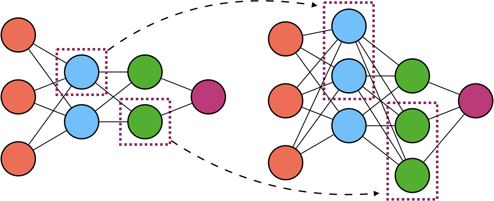
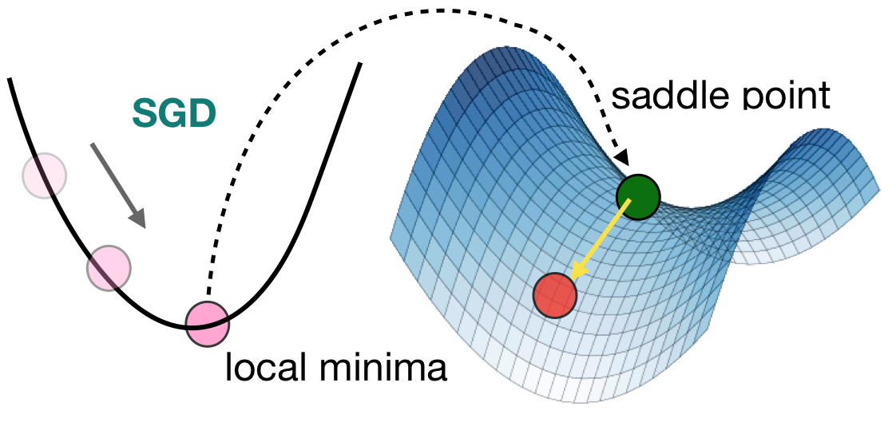
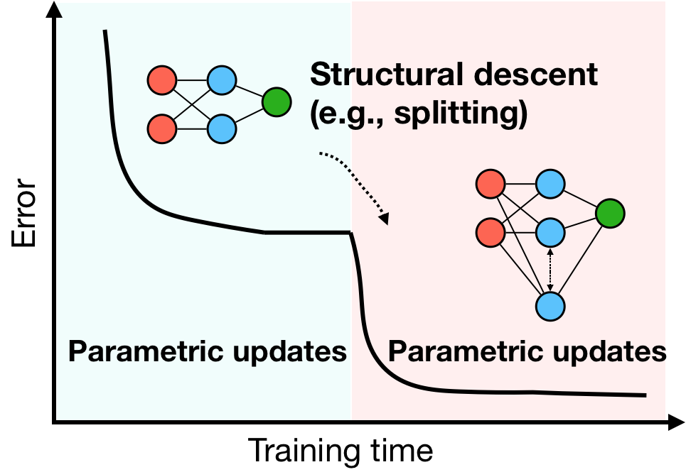

# Energy-Aware Neural Architecture Optimization with Fast Splitting Steepest Descent


**Splitting Yields Adaptive Net Structure Optimization**
  - Starting from a small net, gradually grow the net during training
  - Grow by "splitting" existing neurons into multiple off-springs

</img>

**Why splitting: escaping local minima**

The local optima in the low dimensional space can be turned into a saddle point in a higher dimensional of the augmented networks.

</img>

**Splitting yields monotonic loss improvements**

</img>

## Our results

We apply our method to split small version of MobileNetV1 and MobileNetV2.

**Results on ImageNet using MobileNetV1**


| Model | MACs (G) | Top-1 Accuracy |
| ------ | ------ |------ |
| Splitting-4 | 0.561 | 73.96|
| Splitting-3 | 0.292 | 71.47|
| Splitting-2 | 0.140  | 68.26|
| Splitting-1 | 0.082 | 64.06|
| Splitting-0 (seed) | 0.059 | 59.20|


**Results on ImageNet using MobileNetV2**

| Model | MACs (G) | Top-1 Accuracy |
| ------ | ------ |------ |
| Splitting-3 | 0.298 | 72.84|
| Splitting-2 | 0.208 | 71.76|
| Splitting-1 | 0.095 | 66.53|
| Splitting-0 (seed) | 0.039 | 55.61|


**How to reproduce**
```shell
  1. cd --model-folder--
  2. Download pre-trained models
  3. run ./reproduce
 ```

## Citation
If you find our approach useful in your research, please consider citing:

@article{wang2019energy,
  title={Energy-Aware Neural Architecture Optimization with Fast Splitting Steepest Descent},
  author={Wang, Dilin and Li, Meng and Wu, Lemeng and Chandra, Vikas and Liu, Qiang},
  journal={arXiv preprint arXiv:1910.03103},
  year={2019}
}

@inproceedings{wu2019splitting,
  title={Splitting steepest descent for growing neural architectures},
  author={Wu, Lemeng and Wang, Dilin and Liu, Qiang},
  booktitle={Advances in Neural Information Processing Systems},
  pages={10655--10665},
  year={2019}
}


